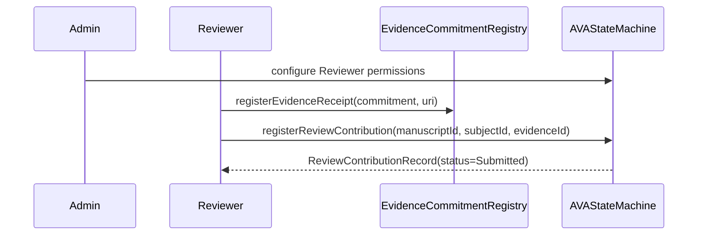
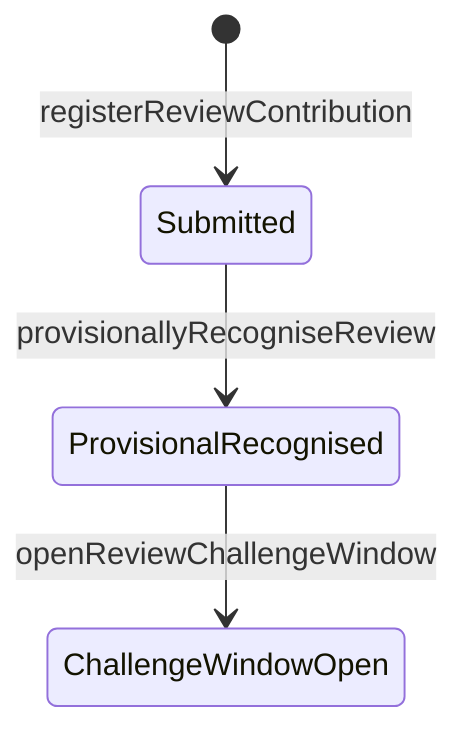
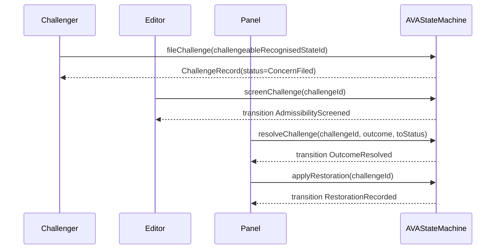
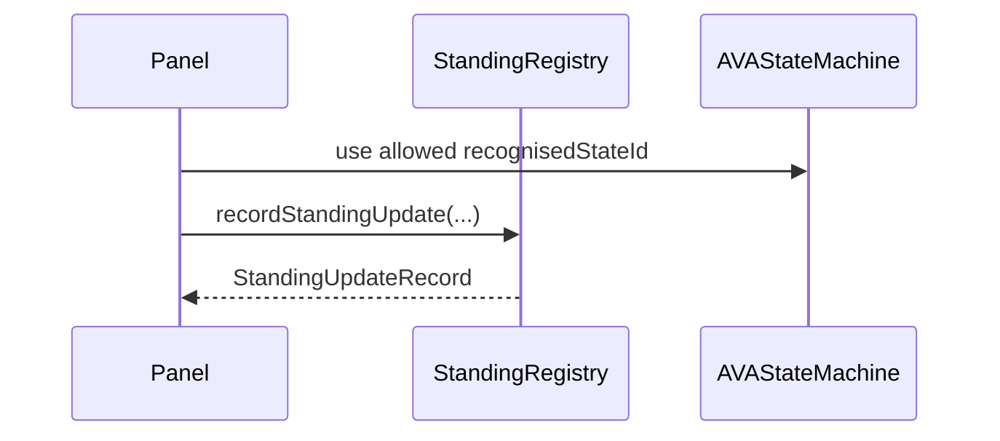
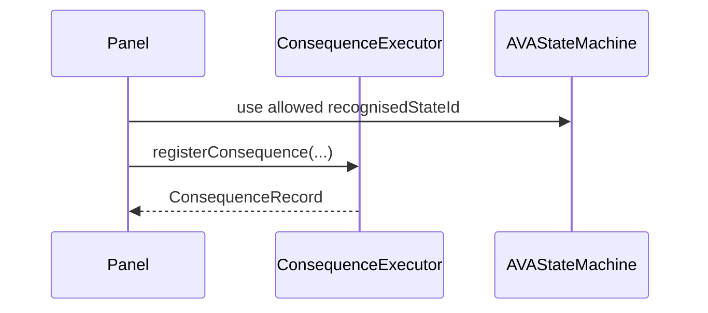
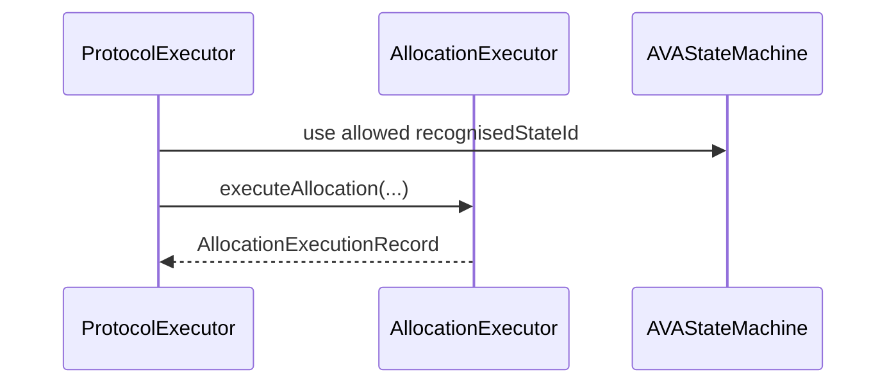
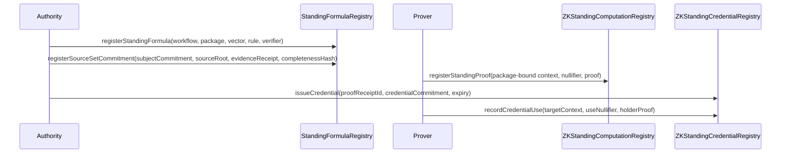

# Demo Scenarios

This file defines the demo flows covered by the current tests and by the local
Foundry demo script.

The scenarios are examples for a peer review technical demo and early sample
of the AVA protocol. They are not production peer-review, publication, payment,
queue, disclosure-reveal, or sanction workflows.

`script/AVADemoScenario.s.sol` is a baseline runtime harness. It demonstrates
core review intake, challenge handling, bounded consequence, standing update,
allocation execution, and audit receipt formation. More advanced ZK standing,
standing-credential, settlement, recovery, and external-operation surfaces are
covered by tests and current architecture docs rather than folded into the
single baseline script.

The script runtime command that avoids the normal sandbox Foundry/macOS
proxy/signature panic is:

```bash
forge script script/AVADemoScenario.s.sol:AVADemoScenario --sig "run()" --offline
```

## Scenario 1: Register A Sealed Review Contribution

Purpose: show that raw review submission is an off-chain evidence reference,
not standing, reward, allocation, or manuscript advantage.



Expected checks:

- review evidence is stored as a commitment or pointer only;
- raw review has no recognised state id;
- standing input counter remains unchanged;
- consequence counter remains unchanged;
- no publication or manuscript merit function is called or exposed.

Current evidence:

- Covered by `testRawReviewAndChallengeDoNotCreateStandingRewardOrSanction`.
- Covered by `testReviewReceiptCanBecomeChallengeableRecognisedStateWithoutStandingOrReward`.

## Scenario 2: Provisional Recognition And Challenge Window

Purpose: show an authorised editor turning a review contribution into a
challengeable recognised state in the Verification stage.



Expected checks:

- only authorised editor role can provisionally recognise the review;
- recognised state stage is `Verification`;
- challenge window changes recognised state to `Challengeable`;
- no standing, consequence, reward, allocation, or manuscript advantage is
  created.

Current evidence:

- Covered by `testReviewReceiptCanBecomeChallengeableRecognisedStateWithoutStandingOrReward`.
- Covered by `testReviewerCannotProvisionallyRecogniseOwnReview`.

## Scenario 3: Challenge, Resolution, And Explicit Restoration

Purpose: show challenge/correction/restoration as authorised transitions over a
recognised state, not raw accusation effects.



Expected checks:

- challenge can target only an existing `Challengeable` recognised state;
- challenge cannot target a raw review contribution;
- filing a challenge does not mutate the recognised state;
- editor can screen but cannot resolve;
- panel can resolve;
- challenger cannot resolve their own challenge;
- `RejectedGoodFaith`, `Negligent`, and `MaliciousOrFabricated` stay distinct;
- malicious/fabricated outcome records abuse finding but executes no sanction;
- restoration is explicit and preserves history;
- no standing, consequence, reward, allocation, or publication effect is
  created automatically.

Current evidence:

- Covered by `testChallengeCorrectionAndRestorationPathKeepsConsequencesBounded`.
- Covered by `testGoodFaithRejectedChallengeCanRestoreTargetWithoutSanction`.
- Covered by `testChallengerCannotResolveOwnChallenge`.
- Covered by `testRawChallengeCannotTargetRawReviewSubmission`.
- Covered by `testEditorCanScreenButCannotResolveChallenge`.
- Covered by `testChallengeOutcomesRemainDistinctWithoutAutomaticConsequences`.
- Covered by `testUnauthorisedCallerCannotRestoreOrCloseChallenge`.

## Scenario 4: Standing Update From Authorised Recognised State

Purpose: show procedural standing weight as a bounded record tied to recognised
state history.



Expected checks:

- raw review cannot create standing;
- raw challenge cannot create standing;
- only authorised role can record standing update;
- only allowed recognised-state statuses can support standing updates;
- standing update has no public prestige, reward, service entitlement, token,
  priority, acceptance, rejection, or manuscript merit effect.

Current evidence:

- Covered by `testAuthorisedPanelCanRecordProceduralStandingUpdateFromRecognisedState`.
- Covered by `testUnauthorisedCallerCannotRecordStandingUpdateOrExecuteAllocation`.
- Covered by `testStandingAndAllocationRejectRawIdsAndProvisionalState`.
- Covered by `testStandingAndAllocationRejectAllDisallowedRecognisedStateStatuses`.
- Covered by `testStandingAndAllocationRejectZeroRequiredFields`.
- Covered by `testLegacyStandingInputCannotBypassStepFourBoundaries`.

## Scenario 5: Bounded Consequence Record From Authorised Recognised State

Purpose: show administrative consequence recording as a bounded governance
record, not sanction or reward execution.



Expected checks:

- raw review cannot create consequence;
- raw challenge cannot create consequence;
- only authorised panel role can register consequence by default;
- editor cannot register consequence by default;
- only bounded consequence kinds are active;
- consequence registration has no standing, allocation, token, payment,
  sanction execution, reward, publication priority, or manuscript merit effect.

Current evidence:

- Covered by `testAuthorisedPanelCanRegisterBoundedConsequenceFromRecognisedState`.
- Covered by `testUnauthorisedAndEditorCallersCannotRegisterBoundedConsequenceByDefault`.
- Covered by `testBoundedConsequenceRejectsRawIdsDisallowedStatusesAndZeroFields`.
- Runtime path covered by `script/AVADemoScenario.s.sol:AVADemoScenario.run`.

## Scenario 6: Allocation Execution From Authorised Recognised State

Purpose: show AVA Allocation as a bounded authorised record.



Expected checks:

- raw review cannot execute allocation;
- raw challenge cannot execute allocation;
- only authorised protocol executor can execute allocation;
- allocation execution has no publication priority or manuscript merit effect;
- allocation remains a protocol record, not a scientific truth judgment.

Current evidence:

- Covered by `testProtocolExecutorCanExecuteBoundedAllocationFromRecognisedState`.
- Covered by `testUnauthorisedCallerCannotRecordStandingUpdateOrExecuteAllocation`.
- Covered by `testStandingAndAllocationRejectRawIdsAndProvisionalState`.
- Covered by `testStandingAndAllocationRejectAllDisallowedRecognisedStateStatuses`.
- Covered by `testStandingAndAllocationRejectZeroRequiredFields`.

## Scenario 7: No-Publication-Advantage Boundary

Purpose: prove the ABI does not expose functions that decide or influence
manuscript acceptance, rejection, merit, review score, score boost, or
publication priority.

Current evidence:

- Covered by `testNoPublicationDecisionOrManuscriptMeritSelectorsExist`.
- Runtime path covered by `script/AVADemoScenario.s.sol:AVADemoScenario.run`.

## Scenario 8: Universal AVA Module Scaffold

Purpose: show that different AVA workflows can bind different stage and rule
modules while sharing the same recognised-state substrate.

Expected checks:

- a review-service workflow package and a challenge/integrity workflow package
  can both be registered;
- both workflows converge on `RecognisedStateRecord` in `AVAStateMachine`;
- disclosure behavior can vary by stage, action, and object through the module
  interface;
- allocation and consequence modules can be swapped without changing the fixed
  substrate;
- swapped modules validate or reject records only, and do not reveal identity,
  transfer value, execute sanctions, score truth, or create publication
  advantage.

Current evidence:

- Covered by `testRulePackagesBindTwoAVAWorkflowsToSameRecognisedStateSubstrate`.
- Covered by `testDisclosureModuleCanVaryByStageActionAndObject`.
- Covered by `testAllocationAndConsequenceModulesAreReplaceableAndRecordOnly`.


## Scenario 9: Privacy-Preserving Standing Proof And Commitment-Bound Credential

Purpose: show that standing can be proven without exposing the account or full
source history that produced the standing computation. This is a chain-side
commitment and proof-use scenario, not a production ZK circuit or a reputation
token.



Expected checks:

- formula metadata and source-set commitments are registered before a ZK
  standing proof receipt can be accepted;
- the proof receipt is bound to stable `packageId`, subject commitment, vector,
  category/range, epoch, source-record-set root, computation-rule hash,
  verifier, and nullifier;
- the commitment-bound credential stores no owner account and exposes no
  transfer, approval, balance, reward, priority, publication, reveal, or
  manuscript-merit surface;
- proof use requires a verifier proof and rejects replayed nullifiers;
- the chain does not compute full standing history, traverse source records, or
  prove source-set completeness by itself.

Current evidence:

- tests cover package-bound standing proof receipts;
- tests reject proof replay and bad subject binding;
- tests reject cross-package proof reuse after workflow re-registration;
- tests require registered formula and source-set commitment records;
- tests reject unauthorised, wrong-package, wrong-evidence, and wrong-verifier
  standing formula paths;
- tests issue commitment-bound credentials without exposing an account owner;
- tests reject credential proof-use nullifier replay;
- tests require credential-holder proof before proof-use succeeds.
