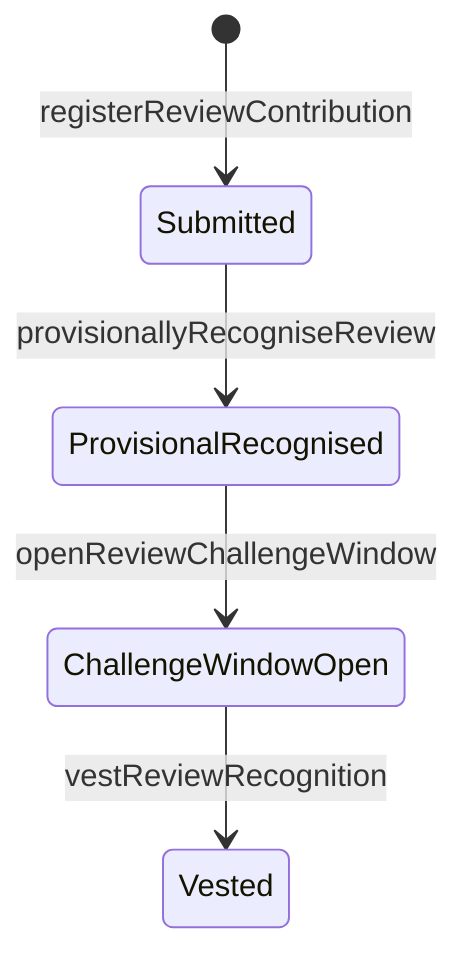
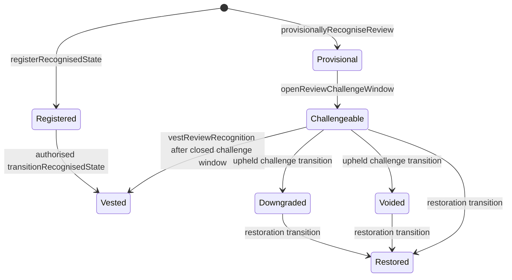
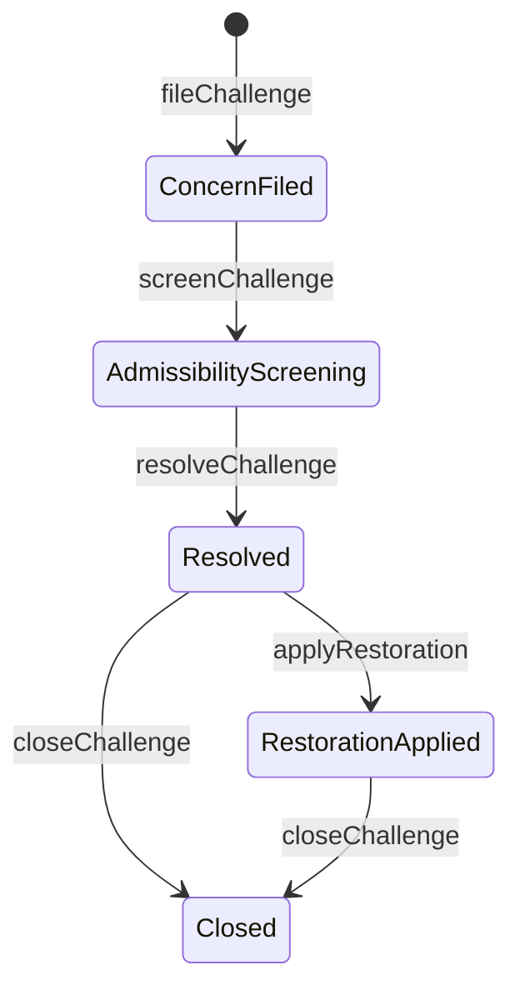
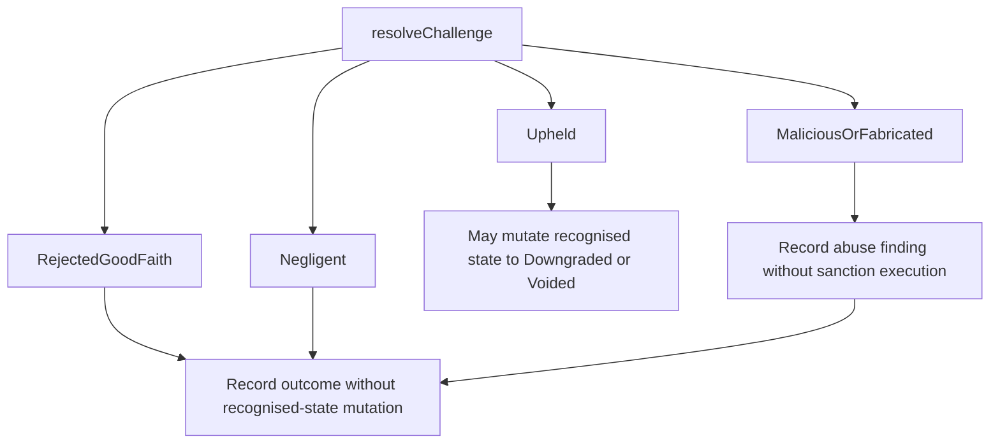
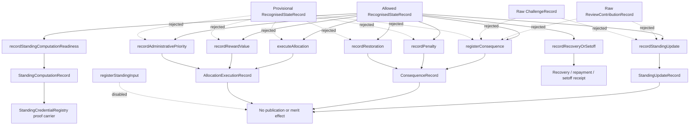

# AVA-PeerReview State Machines

This document mirrors the current contracts and tests. It should be updated
whenever `src/AVAStateMachine.sol` changes.

## Reader Map

Use this file as a state-path reference, not as the first overview document.

- For the review path, read `Review Contribution Path`,
  `Recognised State Statuses`, and `Challenge Lifecycle`.
- For mutation rules, read `Challenge Outcomes` and `Transition Record
  Requirement`.
- For package dispatch and module coverage, read `Module Registry Boundary`.
- For downstream standing, allocation, consequence, reward, priority, penalty,
  restoration, credential, settlement, and proof surfaces, read `Standing And
  Allocation`.

The repeated boundary clauses are intentional. They mark where a raw review,
raw challenge, raw evidence receipt, unsupported status, stale credential, or
wrong package cannot create downstream effects.

## Review Contribution Path



Rules currently enforced:

- `registerReviewContribution` requires `RegisterReviewContribution`, an
  existing manuscript id, a caller-bound reviewer subject, and a registered
  evidence receipt.
- raw `Submitted` review has no recognised state id.
- `provisionallyRecogniseReview` requires `ProvisionallyRecogniseReview`.
- provisional recognition creates a `RecognisedStateRecord` in AVA stage
  `Verification`.
- `openReviewChallengeWindow` requires `OpenChallengeWindow`.
- opening the window sets the linked recognised state to `Challengeable` and
  records the chain timestamp readable through
  `getChallengeWindowOpenedAt(recognisedStateId)`.
- `vestReviewRecognition` requires `TransitionRecognisedState`, rejects if the
  linked recognised state has any unclosed challenge, calls any selected
  `IChallengeWindowRuleModule` timing veto, writes a generic recognised-state
  transition, and sets the linked recognised state to `Vested`.
- default packages remain a permissive baseline, while packages that select
  `SubjectRateLimitModule` can reject repeated challenge filings by the same
  subject against the same recognised state for that package.
- none of these steps creates standing, consequence, reward, sanction,
  allocation, service entitlement, or manuscript advantage.

## Recognised State Statuses



`Draft` and `Frozen` exist in the enum but are not currently moved by the
implemented review/challenge path. Direct public recognised-state registration
cannot create `Vested`, `Restored`, `Downgraded`, or `Voided`. Those
downstream-eligible statuses must be reached through authorised transition
paths that pass transition-rule validation and write generic recognised-state
transition records.

The paper-support matrix in
`generated/recognised-state-transition-matrix.csv` is hash-pinned by
`script/AVATransitionMatrix.s.sol`, and its rows are checked against
row-level kernel executions in the test suite. It records the current substrate
admissibility surface for direct recognised-state creation, review vesting,
generic transition, challenge resolution, and restoration. The matrix is a
deterministic documentation artifact for figures or model extraction; it is
not a replacement for the Solidity transition checks.

## Challenge Lifecycle



Rules currently enforced:

- `fileChallenge` requires `FileChallenge`, a caller-bound challenger subject,
  and a registered evidence receipt.
- the target must be an existing recognised state with status `Challengeable`.
- the target cannot be a raw review contribution.
- filing creates only a `ChallengeRecord`.
- `screenChallenge` requires `ScreenChallenge`.
- screening records an `AdmissibilityScreened` transition and does not decide
  truth or wrongdoing.
- `resolveChallenge` requires `ResolveChallenge`.
- the challenge filer cannot resolve their own challenge.
- resolution records an `OutcomeResolved` transition.
- a ZK-backed anonymous challenge package can require separate action-bound
  proof receipts for filing, screening, and resolution.
- anonymous challenge proof-use receipts bind to `RecordDisclosureExecution`
  context, target challenge id, subject commitment, package id, policy id,
  proof receipt, and nullifier, so a `FileChallenge` proof cannot be reused as
  proof-use.
- only an upheld challenge may mutate the recognised state.
- `applyRestoration` requires `ApplyRestoration`.
- restoration records a `RestorationRecorded` transition and preserves prior
  challenge history. It can restore a recognised state after rejected
  good-faith or malicious/fabricated challenge handling, and the correction
  and restoration package also allows restoration after an upheld challenge has
  already moved the state to
  `Downgraded` or `Voided`.
- `closeChallenge` requires `CloseChallenge`.

Challenge lifecycle admissibility is validated through the workflow package's
`IChallengeLifecycleModule`. The default package uses
`DefaultChallengeLifecycleModule`, preserving the current lifecycle order.
`AVAStateMachine` still owns challenge storage and transition records, and it
keeps non-delegable safety gates such as role-subject binding, authority-id
binding, upstream evidence existence, known recognised-state targets,
`Challengeable` filing targets, challenger self-resolution rejection, direct
high-impact status registration rejection, and generic recognised-state
transition recording.

## Challenge Outcomes



Current outcome effects:

- `Upheld`: may mutate the challenged recognised state to `Downgraded` or
  `Voided` through an authorised transition record.
- `RejectedGoodFaith`: records the outcome without sanction.
- `Negligent`: records the outcome without automatic sanction.
- `MaliciousOrFabricated`: records an abuse finding without automatic sanction.

## Transition Record Requirement

```mermaid
sequenceDiagram
    participant Actor
    participant StateMachine as AVAStateMachine
    participant Record as ChallengeTransitionRecord
    participant StateRecord as RecognisedStateTransitionRecord
    participant State as RecognisedStateRecord

    Actor->>StateMachine: resolveChallenge(...)
    StateMachine->>Record: create OutcomeResolved transition
    alt outcome is Upheld
        StateMachine->>StateRecord: create recognised-state transition
        StateMachine->>State: update status through transition
    else non-mutating outcome
        StateMachine-->>State: no status change
    end
```

Every implemented challenge resolution or restoration path records a
`ChallengeTransitionRecord`. Every recognised-state creation or status mutation
also records a generic `RecognisedStateTransitionRecord` and emits a
`RecognisedStateTransitionRecorded` event. Recognised-state mutation in the
challenge path is paired with this generic transition ledger.

## Publication Boundary

The current ABI tests check that publication-decision and manuscript-merit
selectors are absent. The current contracts do not expose manuscript acceptance,
rejection, merit, score boost, publication priority, or publication decision
functions.

## Module Registry Boundary

`AVARulePackageRegistry` stores workflow-level module bindings for
Attribution, Verification, TransitionRule, Disclosure, Allocation, Standing,
Reward, Priority, Consequence, Penalty, Restoration, ChallengeLifecycle,
EvidencePolicy, Audit, EditorialSystem, ResidualEditorialAuthority,
DisclosureLifecycle, FieldPolicy, and AntiAbuse.
The challenge lifecycle binding uses `IChallengeLifecycleModule`; the default
implementation is `DefaultChallengeLifecycleModule`. The registry does not
create another state machine. Registered modules and adapters validate or
reject records around the fixed substrate:

- role-scoped subjects stay in `RoleIdentityRegistry`;
- authority stays in `AuthorityMatrix`;
- evidence references and evidence-registering role-scoped subjects stay in
  `EvidenceCommitmentRegistry`;
- disclosure policy references stay in `DisclosurePolicyRegistry`;
- recognised states stay in `AVAStateMachine`;
- audit receipts stay in `AttestationAuditModule`; workflow-aware audit records
  must carry a role-scoped authority subject, and evidence/state/transition
  audits use the audited receipt or target object's stable package identity.

Current tests use this scaffold to show a review-service workflow and a
challenge/integrity workflow sharing the same recognised-state substrate.
`AVAStateMachine` dispatches its stage, transition, disclosure,
evidence-policy, evidence-lifecycle, field-policy, anti-abuse, and
challenge-lifecycle admissibility hooks by the active package for the workflow
when a workflow object is formed. Residual editorial authority validation is
called on authorised state-governance actions while `AVAStateMachine` keeps
storage and mutation gates. The resulting review contribution, recognised
state, challenge, transition, and downstream records bind the stable `packageId`
used at creation time. `StandingRegistry`, `AllocationExecutor`,
`ConsequenceExecutor`, and target-bound audit paths dispatch adapters by
reading the target recognised state, transition, challenge transition, or
evidence receipt `packageId`, not by reloading the current package for the
workflow key. Evidence receipts used to form workflow objects or downstream
records must belong to the same workflow as the object or target recognised
state; cross-workflow evidence references are rejected as substrate errors.
Scenario tests cover that historical binding across double-blind review
vesting, anonymous challenge proof-use/resolution, and correction/restoration
records after same-workflow re-registration.

Current module coverage:

| Family | Interface | Default module | Example module | Workflow binding | Current limit |
| --- | --- | --- | --- | --- | --- |
| Attribution | `IAttributionModule` | `DefaultAttributionModule` | `SubjectSaltAttributionModule` | Rule package | Validates attributed object only |
| Verification | `IVerificationModule` | `DefaultVerificationModule` | `EvidenceThresholdVerificationModule` | Rule package | Validates references, not truth |
| Transition rule | `ITransitionRuleModule` | `DefaultTransitionRuleModule` | `NoFrozenTransitionRuleModule`, `MinimumChallengeWindowTransitionModule` | Rule package | Cannot own state storage; optional challenge-window timing veto before vesting when the module declares support |
| Disclosure/privacy | `IDisclosurePolicyModule` | `DefaultDisclosurePolicyModule` | disclosure scenario modules, `ZKBackedDisclosureModule` | Rule package and evidence registry | No reveal or decryption |
| Challenge lifecycle | `IChallengeLifecycleModule` | `DefaultChallengeLifecycleModule` | `PanelOnlyChallengeLifecycleModule` | Rule package | Admissibility only |
| Evidence policy | `IEvidencePolicyModule` | `DefaultEvidencePolicyModule` | `TypedEvidencePolicyModule` | Rule package | Active on workflow-scoped evidence registration and recognised-state validation; reference/type/workflow validation only |
| Audit adapter | `IAuditAdapter` | `DefaultAuditAdapter` | `HashAnchoredAuditAdapter` | Evidence receipt or target `packageId` | Active on workflow-aware and target-bound attestation paths; attestation reference and authority-subject validation only |
| Editorial adapter | `IEditorialSystemAdapter` | `DefaultEditorialSystemAdapter` | `EditorialReferenceAdapter` | Rule package | Workflow-aware manuscript overload requires a known package; adapter is active only when optional external reference metadata is supplied |
| Residual editorial authority | `IResidualEditorialAuthorityModule` plus `AuthorityApprovalRegistry` for receipt-backed examples | `DefaultResidualEditorialAuthorityModule` | `ProceduralEditorialAuthorityModule`, `StructuredResidualEditorialAuthorityModule`, `ApprovalReceiptAuthorityModule`, `CredentialGatedPanelModule` | Rule package | Procedural authority validation only; supports single-role, threshold-panel, multisig, institutional-co-signature, conflict-excluded-panel, emergency-pause, approval-receipt, and standing-credential-gated validator formats without publication decision or merit logic |
| Field policy | `IFieldPolicyModule` | `DefaultFieldPolicyModule` | `DisciplineFieldPolicyModule` | Rule package | Active on recognised-state validation; discipline rule validation only |
| Anti-abuse | `IAntiAbuseModule` / optional `IChallengeRateLimitModule` | `DefaultAntiAbuseModule` | `SubjectRateLimitModule`, `RestrictionAwareChallengeIntakeModule` | Rule package | Active on review, challenge, and downstream record paths; default package is a permissive baseline; example modules can veto selected subject/object/action paths, repeated challenge filings, or active challenge-intake eligibility restrictions; no sanction execution |
| Standing | `IStandingAdapter` | `DefaultStandingAdapter` | `VectorStandingAdapter` | Recognised-state `packageId` | Procedural weight record only |
| Reward/value | `IRewardAdapter` | `DefaultRewardAdapter` | `StablecoinRecordRewardAdapter`, `GenericTokenRecordRewardAdapter` | Recognised-state `packageId` | Record only, no transfer |
| Priority | `IPriorityAdapter` | `DefaultPriorityAdapter` | `PriorityTokenRecordAdapter`, `RentedPriorityRecordAdapter` | Recognised-state `packageId` | Administrative queue record only |
| Penalty | `IPenaltyAdapter` | `DefaultPenaltyAdapter` | `ProceduralPenaltyRecordAdapter`, `PriorityReturnObligationRecordAdapter` | Recognised-state `packageId` | Record only, no sanction execution |
| Restoration | `IRestorationAdapter` | `DefaultRestorationAdapter` | `RestorationProcedureRecordAdapter`, `CorrectionRestorationRecordAdapter` | Recognised-state `packageId` | Repair record only |
| General consequence | `IConsequenceAdapter` | `DefaultConsequenceAdapter` | `BoundedConsequenceExampleAdapter` | Recognised-state `packageId` | Administrative/procedural record only |
| Disclosure lifecycle readiness | `IDisclosureLifecycleModule` | `DefaultDisclosureLifecycleModule` | `RejectingDisclosureLifecycleModule` | Rule package | Readiness records only; no reveal, decrypt, ACL engine, or identity disclosure |

Reference-integrity checks add substrate-level disclosure policy existence
checks before disclosure-lifecycle readiness records and require
`ZKProofRegistry` proof receipts to reference a known active workflow package
and a registered disclosure policy, and to store the active package id for the
proof context. These remain receipt/readiness checks only; they do not reveal
identity or content.

## Standing And Allocation

This section is a reference checklist for downstream surfaces. The short rule
is:

- only eligible recognised-state statuses can support downstream records;
- raw review ids, raw challenge ids, raw evidence ids, unknown ids, inactive
  subjects, unsupported statuses, and cross-package references are rejected;
- standing, credentials, consequences, allocations, settlements, and external
  operation receipts stay source-bound and do not create publication,
  manuscript-merit, reveal, sanction-execution, or standing-token effects.



Allowed recognised-state statuses for consequences, standing updates,
allocation execution, reward/value records, administrative-priority records,
penalty records, and restoration records:

- `Vested`
- `Restored`
- `Downgraded`
- `Voided`

Rules currently enforced:

- `registerConsequence` requires `RegisterConsequence`.
- `recordPenalty` and `recordRestoration` require `RegisterConsequence`.
- `recordStandingUpdate` requires `RecordStandingUpdate`.
- `executeAllocation` requires `ExecuteAllocation`.
- `recordRewardValue` and `recordAdministrativePriority` require
  `ExecuteAllocation`.
- consequences, standing, allocation, reward/value, administrative priority,
  penalty, and restoration reject raw review ids, raw challenge ids, unknown
  recognised-state ids, unsupported recognised-state statuses, and unknown or
  inactive target subjects.
- legacy `registerStandingInput` is disabled in the active demo so it cannot
  bypass recognised-state/status/evidence/authority checks.
- `evidenceReceiptId` must be nonzero, registered, workflow-scoped, package
  bound, and currently `Active` in `EvidenceCommitmentRegistry`; upstream
  review, recognised-state, and challenge formation also reject unknown,
  cross-workflow, unscoped, or non-active evidence ids. Downstream paths apply
  the same usable-evidence check. These paths do not validate scientific truth,
  disclosure eligibility, or evidence content.
- authority ids representing the acting authority must match the caller's
  active role-scoped subject.
- recognised states store the responsible role-scoped subject. Standing and
  consequence / penalty / restoration records that target a recognised state
  must use the same responsible subject unless a future explicitly designed
  cross-subject record type is added.
- downstream adapters are selected from the target recognised state's recorded
  package id, so re-registering a workflow key cannot rewrite old state
  behaviour.
- consequence registration does not create standing or allocation records.
- standing updates do not create allocation or consequence records.
- allocation executions do not create standing or consequence records.
- reward/value, administrative-priority, penalty, recovery, setoff, waiver,
  satisfaction, and restoration records are adapter surfaces and route through
  value-execution readiness validation where relevant.
- penalty is decomposed into value recovery, standing penalty input, and
  eligibility / screening consequence. Standing penalty input is consumed by
  later standing computation; it is not a token deduction or balance update.
- standing penalty input requires a nonzero compatible challenge outcome:
  upheld for academic-fraud or irresponsible-review inputs, negligent for
  negligent-challenge inputs, and malicious/fabricated for malicious-challenge
  inputs. Rejected good-faith challenges cannot create misconduct standing
  penalty input.
- reward and penalty reversal is append-only: grant, execution, freeze, void,
  repayment obligation, setoff, waiver, satisfaction, reversal, and restoration
  records are retained rather than deleted.
- setoff, waiver, and satisfaction are mutually exclusive terminal recovery
  receipts for a source. Open escrow deposits cannot receive recovery receipts,
  and refunded escrow sources cannot become recovery chains.
- generic allocation and generic consequence records also route through the
  same value-execution readiness surface, with parameterized record-only asset,
  payer, amount/units, mode, execution-reference, authority, evidence, and URI
  fields.
- the execution-readiness flow is: authorisation, recognised-state gate,
  execution context validation, evidence reference check, recognised-state
  package lookup, anti-abuse, value execution adapter, domain adapter,
  record-only storage.
- rule-package lifecycle, evidence lifecycle, and standing-computation
  readiness surfaces record metadata only. Rule-package lifecycle readiness
  includes lifecycle kind plus stable target package metadata for
  migration/supersession records; it still does not execute migration, reveal
  evidence, adjudicate truth, or compute public reputation.
- standing credential issuance can consume an authorised standing-computation
  record and write only a non-transferable, expiring, revocable/supersedable
  proof carrier. It does not create standing, reputation, reward, priority,
  allocation, consequence, publication, or manuscript-merit effects.
- standing credential proof is package-, subject-, vector-, category-,
  threshold-, and range-bound.
- standing-computation records bind epoch, source-record-set hash,
  computation-rule hash, and active/superseded/invalidated status. Credentials
  can prove only while the source computation remains active.
- the Formula V0 standing-computation example validates bounded reversible
  outputs for the four demo vectors. It does not compute complete historical
  standing and does not apply standing.
- ZK standing computation receipts bind active workflow package, subject
  commitment, vector/category/range, source-record-set root, computation-rule
  hash, exact registered formula/source-set commitment, active source-set
  completeness attestation, active computation statement, output commitment,
  formula version, source-set policy hash, verifier reference, proof-domain
  hash, and nullifier. They support future privacy-preserving credential
  issuance gates but do not reveal identity or compute full standing history on
  chain.
- formula/source-set/statement records bind workflow package, formula
  version, source-set policy hash, decay/cap/restoration policy hashes, source
  evidence receipt, source-record-set root, verifier reference, completeness
  attestation hash, output commitment, and authority before a ZK standing proof
  receipt can be accepted. They are the chain-side trust boundary for off-chain
  or future-ZK standing computation: they make the formula/source-set/output
  claim auditable, but they do not calculate standing, traverse full history, or
  prove source-set completeness by themselves.
- ZK standing credentials are commitment-bound proof carriers issued from ZK
  standing computation receipts. They bind package, subject commitment,
  credential commitment, vector/category/range, epoch, source-record-set root,
  computation-rule hash, expiry, and authority. Proof-use records require a
  verifier proof whose public key matches the stored credential commitment and
  reject replayed use nullifiers; they expose no owner account, balance,
  transfer, approval, reward, priority, reveal, publication, or manuscript-merit
  surface.
- credential proof checks also require the source computation statement
  referenced by the ZK proof receipt to remain active. Superseded or invalidated
  statements stop supporting stale credential proof without deleting prior
  proof or credential history.
- source-bound ZK credential suspension records require either a matching
  value-settlement record or a matching challenge transition record. Good-faith
  rejected challenges cannot suspend a credential as misconduct; negligent and
  malicious/fabricated challenge transitions can be recorded as
  standing-relevant suspension sources without executing sanctions or standing
  updates.
- standing-relevant settlement impact records suspend the subject's active
  standing credential before it can be used as proof again unless a fresh
  standing computation issues a new credential. The referenced value-settlement
  record must exist and match the same source, subject, package identity, and
  settlement kind. Unrelated settlement sources cannot suspend a credential.
  Relevant settlements include reward execution, voiding, downgrade,
  restoration, penalty input, repayment obligation, setoff, waiver,
  satisfaction, credential suspension, and eligibility restoration.
- governance-memory records can be read by validator-only modules in selected
  packages: active challenge-intake eligibility restrictions can veto later
  challenge filing by the same subject until expiry, and active
  standing-credential proof can gate a configured panel action. These
  validators do not write state, update standing, execute sanctions, allocate
  value, or affect publication outcomes.
- anonymous challenge proof-use receipts store the referenced proof receipt's
  proof context hash, verifier, and proof-domain hash while preserving
  no-reveal semantics.
- external operation receipts store an operation context hash and terminal
  receipts link to their source operation; they do not execute external queues,
  billing, sanctions, or publication actions.
- value-settlement receipts store source execution mode, source settlement
  kind, source execution reference, and a settlement context hash; priority
  token paths remain bounded administrative queue/service-right artifacts only.
- none of these paths exposes publication priority, manuscript merit,
  acceptance, or rejection functions.
- current verification is 263 tests passing.
- The current state-machine surface includes authorised standing computation,
  credential use-surface hardening, disclosure proof-use, and lifecycle-record
  closure hardening.
- there is no privacy reveal, production token/payment integration, sanction
  execution, publication logic, model, or simulation in the current state
  machines. Mock settlement receipts are downstream execution records,
  not state-machine publication or standing/reputation logic.
